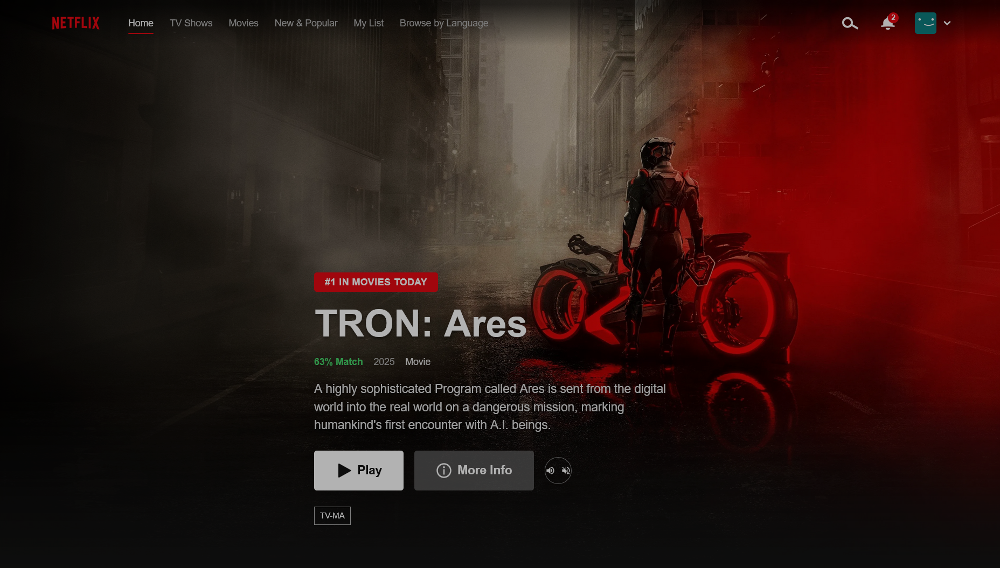

<div align="center">

# 🎬 Netflix Clone

### A Production-Grade Streaming Platform UI Built With Vanilla JavaScript

[](https://flixvista.vercel.app/)

<!-- [](https://github.com/mujeebdev3/netflix-clone-vanilla-javascript/stargazers)
-->
<p align="center">
  
  
  
  
  
  
</p>

<p align="center">
  A pixel-perfect, enterprise-grade Netflix clone featuring real-time movie data, infinite scrolling, and a fully responsive design. Built entirely with vanilla JavaScript—no frameworks, just modern web development best practices.
</p>

<p align="center">
  <a href="#-features">Features</a> •
  <a href="#-live-demo">Demo</a> •
  <a href="#-quick-start">Quick Start</a> •
  <a href="#-documentation">Documentation</a> •
  <a href="#-contributing">Contributing</a>
</p>



</div>

---

## 📋 Table of Contents

- [✨ Features](#-features)
- [🎯 Why This Project?](#-why-this-project)
- [🚀 Live Demo](#-live-demo)
- [🛠️ Tech Stack](#️-tech-stack)
- [🎨 Design System](#-design-system)
- [🔌 API Integration](#-api-integration)
- [♿ Accessibility](#-accessibility)
- [📸 Screenshots](#-screenshots)
- [🏃 Quick Start](#-quick-start)
- [📖 Documentation](#-documentation)
- [🧪 Testing](#-testing)
- [🌍 Browser Support](#-browser-support)
- [🚢 Deployment](#-deployment)
- [🤝 Contributing](#-contributing)
- [🙏 Acknowledgments](#-acknowledgments)
- [📧 Contact](#-contact)

---

## ✨ Features

### 🎬 Core Features

<table>
  <tr>
    <td width="50%">
      
**🎯 Dynamic Content**
- Real-time movie data from TMDB API
- Multiple content categories (Trending, Popular, Top Rated, Upcoming)
- Genre-based filtering and discovery
- Intelligent content recommendations
      
    </td>
    <td width="50%">
      
**🎨 Rich UI/UX**
- Pixel-perfect Netflix design recreation
- Hero banner with auto-rotating featured content
- Smooth 60fps animations and transitions
- Interactive hover effects and card scaling
      
    </td>
  </tr>
  <tr>
    <td width="50%">
      
**📱 Responsive Design**
- Mobile-first architecture
- Touch-enabled horizontal scrolling
- Hamburger menu for mobile navigation
- Optimized for all screen sizes (320px - 4K)
      
    </td>
    <td width="50%">
      
**⚡ Performance**
- Lazy loading for images and content
- Debounced search and scroll events
- Skeleton loaders for perceived performance
- Optimized API calls with caching
      
    </td>
  </tr>
  <tr>
    <td width="50%">
      
**♿ Accessibility**
- WCAG 2.1 AA compliant
- Full keyboard navigation support
- Screen reader optimized with ARIA labels
- Semantic HTML5 structure
      
    </td>
    <td width="50%">
      
**🔧 Technical Excellence**
- 100% vanilla JavaScript (no frameworks)
- BEM methodology for scalable CSS
- Custom state management system
- Comprehensive error handling
      
    </td>
  </tr>
</table>

---

## 🎯 Why This Project?

This Netflix Clone demonstrates **enterprise-level frontend engineering** skills:

- ✅ **Framework-Free Mastery** — Proves deep JavaScript understanding without framework dependency
- ✅ **API Integration** — Real-world RESTful API consumption with error handling
- ✅ **Scalable Architecture** — BEM methodology, component-based design, separation of concerns
- ✅ **Production-Ready** — Performance optimized, accessible, and deployment-ready
- ✅ **Best Practices** — Follows industry standards for HTML, CSS, and JavaScript

Perfect for showcasing to **recruiters, hiring managers, and development teams**.

---

## 🚀 Live Demo

### 🌐 [View Live Application](https://flixvista.vercel.app/)

> **Note:** This is a frontend-only application. No authentication is required to browse content. All movie data is fetched in real-time from the TMDB API.

**Try these features:**

- 🎬 Browse trending and popular movies
- 🔍 Search for your favorite titles
- 📱 Test responsive design on different devices
- ⌨️ Navigate using keyboard only (Tab, Enter, Escape)

---

## 🛠️ Tech Stack

### Core Technologies

| Technology                                                                                                      | Version | Purpose                                    |
| --------------------------------------------------------------------------------------------------------------- | ------- | ------------------------------------------ |
|                 | HTML5   | Semantic markup and structure              |
|                    | CSS3    | Styling, animations, and responsive design |
|  | ES2020+ | Application logic and interactivity        |
|        | API v3  | Real-time movie data and images            |

### Development & Deployment

| Tool                 | Purpose                             |
| -------------------- | ----------------------------------- |
| **Git**              | Version control                     |
| **VS Code**          | Code editor                         |
| **Live Server**      | Local development server            |
| **Vercel / Netlify** | Production deployment               |
| **Chrome DevTools**  | Debugging and performance profiling |

### CSS Architecture

- **BEM (Block Element Modifier)** — Scalable naming convention
- **CSS Custom Properties** — Design tokens and theming
- **CSS Grid & Flexbox** — Modern layout systems
- **Mobile-First Approach** — Progressive enhancement
- **Component-Based Styling** — Modular and reusable

### JavaScript Patterns

- **ES6+ Syntax** — Modern JavaScript features
- **Async/Await** — Clean asynchronous code
- **Event Delegation** — Efficient event handling
- **Custom State Management** — Vanilla JS state system
- **Module Pattern** — Organized code structure

---

## 🎨 Design System

### Color Palette

```css
/* Primary Brand Colors */
--netflix-red: #e50914;
--netflix-black: #141414;
--netflix-dark-gray: #181818;

/* Background Colors */
--bg-primary: #141414;
--bg-secondary: #181818;
--bg-tertiary: #2f2f2f;

/* Text Colors */
--text-primary: #ffffff;
--text-secondary: #e5e5e5;
--text-muted: #808080;

/* Status Colors */
--color-success: #10b981;
--color-warning: #f59e0b;
--color-error: #ef4444;
--color-info: #3b82f6;

/* Overlay & Shadow */
--overlay-dark: rgba(0, 0, 0, 0.7);
--shadow-medium: 0 4px 12px rgba(0, 0, 0, 0.5);
```

### Typography

```css
/* Font Family */
--font-primary: "Netflix Sans", "Helvetica Neue", Helvetica, Arial, sans-serif;

/* Font Sizes */
--text-xs: 0.75rem; /* 12px */
--text-sm: 0.875rem; /* 14px */
--text-base: 1rem; /* 16px */
--text-lg: 1.125rem; /* 18px */
--text-xl: 1.25rem; /* 20px */
--text-2xl: 1.5rem; /* 24px */
--text-3xl: 2rem; /* 32px */
--text-4xl: 2.5rem; /* 40px */
--text-5xl: 3rem; /* 48px */

/* Font Weights */
--font-light: 300;
--font-normal: 400;
--font-medium: 500;
--font-semibold: 600;
--font-bold: 700;
```

### Spacing Scale (8px System)

```css
--space-1: 0.25rem; /* 4px */
--space-2: 0.5rem; /* 8px */
--space-3: 0.75rem; /* 12px */
--space-4: 1rem; /* 16px */
--space-5: 1.5rem; /* 24px */
--space-6: 2rem; /* 32px */
--space-8: 3rem; /* 48px */
--space-10: 4rem; /* 64px */
```

### Responsive Breakpoints

```css
/* Mobile First */
--breakpoint-sm: 640px; /* Small devices (phones) */
--breakpoint-md: 768px; /* Medium devices (tablets) */
--breakpoint-lg: 1024px; /* Large devices (laptops) */
--breakpoint-xl: 1280px; /* Extra large (desktops) */
--breakpoint-2xl: 1536px; /* 2X large (large desktops) */
```

---

## 🔌 API Integration

### TMDB API

This project uses **[The Movie Database (TMDB) API](https://www.themoviedb.org/documentation/api)** for real-time movie data.

#### Key Endpoints

| Endpoint                      | Purpose                    | Parameters                       |
| ----------------------------- | -------------------------- | -------------------------------- |
| `/trending/all/{time_window}` | Fetch trending content     | `time_window`: `day` or `week`   |
| `/movie/popular`              | Get popular movies         | `page`, `language`               |
| `/movie/top_rated`            | Fetch top-rated movies     | `page`, `language`               |
| `/movie/upcoming`             | Get upcoming releases      | `page`, `region`                 |
| `/movie/{movie_id}`           | Get movie details          | `movie_id`, `append_to_response` |
| `/genre/movie/list`           | List all genres            | `language`                       |
| `/discover/movie`             | Discover movies by filters | `with_genres`, `sort_by`         |
| `/search/movie`               | Search movies by title     | `query`, `page`                  |

#### Getting Your API Key

1. Create a free account at [TMDB](https://www.themoviedb.org/signup)
2. Navigate to **Settings → API**
3. Request an API key (developer account)
4. Copy your API key and add it to `.env`

```env
TMDB_API_KEY=your_api_key_here
```

---

## ♿ Accessibility

### WCAG 2.1 AA Compliance

This project follows **Web Content Accessibility Guidelines (WCAG) 2.1 Level AA** standards:

#### Accessibility Features

- ✅ **Semantic HTML5** — Proper use of `<header>`, `<nav>`, `<main>`, `<section>`, `<article>`, `<footer>`
- ✅ **ARIA Labels** — Screen reader support for interactive elements
- ✅ **Keyboard Navigation** — Full site navigation via keyboard (Tab, Enter, Escape, Arrow keys)
- ✅ **Focus Management** — Visible focus indicators on all interactive elements
- ✅ **Color Contrast** — Minimum 4.5:1 contrast ratio for text
- ✅ **Alt Text** — Descriptive alternative text for all images
- ✅ **Skip Links** — Skip to main content for screen reader users
- ✅ **Responsive Text** — Text scales appropriately for readability

#### Keyboard Shortcuts

| Key               | Action                                         |
| ----------------- | ---------------------------------------------- |
| `Tab`             | Navigate forward through interactive elements  |
| `Shift + Tab`     | Navigate backward through interactive elements |
| `Enter` / `Space` | Activate buttons and links                     |
| `Escape`          | Close modals and overlays                      |
| `Arrow Keys`      | Navigate within content sliders                |

---

## 📸 Screenshots

Explore detailed views of the application across different devices and features.

<table>
  <tr>
    <td colspan="2">
      <h3>🖥️ Desktop Experience</h3>
    </td>
  </tr>
  <tr>
    <td width="50%">
      
      <p align="center"><strong>Hero Section & Content Rows</strong></p>
    </td>
    <td width="50%">
      
      <p align="center"><strong>Interactive Movies</strong></p>
    </td>
  </tr>
  <tr>
    <td colspan="2">
      <h3>📱 Mobile & Tablet Views</h3>
    </td>
  </tr>
  <tr>
    <td width="50%">
      
      <p align="center"><strong>Tablet Responsive Layout</strong></p>
    </td>
    <td width="50%">
      
      <p align="center"><strong>Mobile-Optimized Interface</strong></p>
    </td>
  </tr>
</table>

<details>
<summary><strong>🎨 View More Screenshots</strong></summary>

<br/>

### Additional Features

<table>
  <tr>
    <td width="50%">
      
      <p align="center"><strong>Real-time Search</strong></p>
    </td>
    <td width="50%">
      
      <p align="center"><strong>Mobile Navigation</strong></p>
    </td>
  </tr>
</table>

</details>

---

## 🏃 Quick Start

Before you begin, ensure you have:

- **Node.js** (v14.0.0 or higher) (Optional) — [Download here](https://nodejs.org/)
- **Git** — [Download here](https://git-scm.com/)
- **TMDB API Key** — [Get one free here](https://www.themoviedb.org/settings/api)
- A modern web browser (Chrome, Firefox, Safari, Edge)

### Installation

```bash
# 1. Clone the repository
git clone https://github.com/mujeebdev3/netflix-clone-vanilla-javascript

# 2. Navigate to project directory
cd netflix-clone

# 3. Create environment file (Optional)
cp .env.example .env

# 4. Add your TMDB API key to .env
## Update this with your actual API key if running a server/backend.
TMDB_API_KEY=your_actual_api_key_here

# 5. Open with Live Server or any local server
# No build process needed - it's vanilla JavaScript!
```

### Running Locally

**Option 1: VS Code Live Server (Recommended)**

1. Install the [Live Server extension](https://marketplace.visualstudio.com/items?itemName=ritwickdey.LiveServer)
2. Right-click `index.html`
3. Select "Open with Live Server"

**Option 2: Python HTTP Server**

```bash
# Python 3
python -m http.server 8000

# Python 2
python -m SimpleHTTPServer 8000
```

**Option 3: Node.js HTTP Server**

```bash
npx http-server -p 8000
```

Then open `http://localhost:8000` in your browser.

---

## 📖 Documentation

For detailed documentation, please refer to:

- 📘 [**SETUP.md**](./SETUP.md) — Complete setup and configuration guide
- 🤝 [**CONTRIBUTING.md**](./CONTRIBUTING.md) — How to contribute to this project
- 🛡️ [**CODE_OF_CONDUCT.md**](./CODE_OF_CONDUCT.md) — Community guidelines
- 🔒 [**SECURITY.md**](./SECURITY.md) — Security policy and reporting vulnerabilities

---

## 🧪 Testing

### Manual Testing Checklist

- [ ] Navigation bar is sticky on scroll
- [ ] Hero banner auto-rotates every 5 seconds
- [ ] Movie cards display hover effects
- [ ] Modal opens/closes correctly
- [ ] Search functionality works
- [ ] Content loads dynamically from API
- [ ] Responsive design works on mobile, tablet, desktop
- [ ] Keyboard navigation functions properly
- [ ] Error states display appropriately

### Browser Testing

Tested on:

- ✅ Chrome 90+
- ✅ Firefox 88+
- ✅ Safari 14+
- ✅ Edge 90+
- ✅ Opera 76+

### Accessibility Testing

- Lighthouse Accessibility Score: **95+**
- WAVE Web Accessibility Evaluation: **0 errors**
- Keyboard Navigation: **Fully functional**

---

## 🌍 Browser Support

| Browser                                                                                                       | Version | Status             |
| ------------------------------------------------------------------------------------------------------------- | ------- | ------------------ |
|  | 90+     | ✅ Fully Supported |
|     | 88+     | ✅ Fully Supported |
|        | 14+     | ✅ Fully Supported |
|     | 90+     | ✅ Fully Supported |
|           | 76+     | ✅ Fully Supported |

### Required Features

- CSS Grid & Flexbox
- CSS Custom Properties (CSS Variables)
- ES6+ JavaScript (Arrow functions, async/await, template literals)
- Fetch API
- IntersectionObserver API (for lazy loading)

---

## 🚢 Deployment

### Quick Deploy

[](https://app.netlify.com/start/deploy?repository=https://github.com/yourusername/netflix-clone)

[](https://vercel.com/new/clone?repository-url=https://github.com/yourusername/netflix-clone)

### Deployment Platforms Comparison

| Platform             | Difficulty  | Build Time | Custom Domain | HTTPS | CDN |
| -------------------- | ----------- | ---------- | ------------- | ----- | --- |
| **Vercel**           | ⭐ Easy     | ~1 min     | ✅            | ✅    | ✅  |
| **Netlify**          | ⭐ Easy     | ~1 min     | ✅            | ✅    | ✅  |
| **GitHub Pages**     | ⭐⭐ Medium | ~2 min     | ✅            | ✅    | ✅  |
| **Cloudflare Pages** | ⭐⭐ Medium | ~2 min     | ✅            | ✅    | ✅  |

---

## 🤝 Contributing

Contributions, issues, and feature requests are welcome!

Feel free to check the [issues page](https://github.com/mujeebdev3/netflix-clone-vanilla-javascript/issues) or submit a new issue.

### How to Contribute

1. **Fork the Project**
2. **Create your Feature Branch** (`git checkout -b feature/AmazingFeature`)
3. **Commit your Changes** (`git commit -m 'Add some AmazingFeature'`)
4. **Push to the Branch** (`git push origin feature/AmazingFeature`)
5. **Open a Pull Request**

Please read our [Code of Conduct](CODE_OF_CONDUCT.md) before contributing.

### Development Guidelines

- Follow BEM naming convention for CSS
- Use ES6+ JavaScript features
- Write meaningful commit messages (use [Conventional Commits](https://www.conventionalcommits.org/))
- Test across multiple browsers before submitting PR
- Ensure accessibility compliance (WCAG 2.1 AA)
- Update documentation for new features

---

## 🙏 Acknowledgments

### Technologies & APIs

- **[The Movie Database (TMDB)](https://www.themoviedb.org/)** — For providing the excellent movie database API
- **[Netflix](https://www.netflix.com/)** — Design inspiration and UI reference

### Resources & Learning

- **[MDN Web Docs](https://developer.mozilla.org/)** — Web development documentation
- **[CSS-Tricks](https://css-tricks.com/)** — CSS techniques and best practices
- **[JavaScript.info](https://javascript.info/)** — Modern JavaScript tutorials
- **[Web.dev](https://web.dev/)** — Performance and accessibility guidelines

### Community

- **[Stack Overflow](https://stackoverflow.com/)** — Problem-solving and debugging
- **[GitHub](https://github.com/)** — Open-source collaboration platform

### Special Thanks

- The open-source community for inspiration and guidance
- TMDB for their generous free API tier
- All contributors who help improve this project

---

## 📧 Contact

**Created by AbdulMujeeb**

[](https://github.com/mujeebdev3)

### 💬 Get in Touch

Have feedback, suggestions, or questions? I'd love to hear from you!

- 🐛 **Report Issues** - [Open an Issue](https://github.com/mujeebdev3/netflix-clone-vanilla-javascript/issues)
- 💡 **Share Ideas** - [Start a Discussion](https://github.com/mujeebdev3/netflix-clone-vanilla-javascript/discussions)

---

<div align="center">

### ⭐ Star this repository if you found it helpful!

### 🍴 Fork this repository to customize it for your needs!

**Made with ❤️ and ☕ by AbdulMujeeb**

[](https://github.com/mujeebdev3)

---

**Netflix Clone** © 2025 • [MIT License](LICENSE)

</div>
